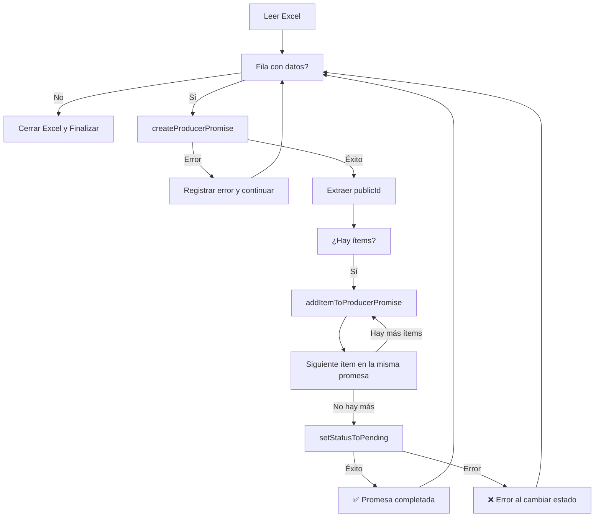

# Automatización DCP - Servicios SOAP Encadenados

Automatización para la creación y gestión de promesas de pago de productores mediante servicios SOAP de Guidewire BillingCenter.

## 📋 Descripción

Este proyecto automatiza el proceso de creación de promesas de pago de productores leyendo datos desde un archivo Excel y ejecutando una secuencia de 3 servicios SOAP encadenados:

1. **createProducerPromise**: Crea una nueva promesa de pago y devuelve un `publicId`
2. **addItemToProducerPromise**: Agrega ítems (pólizas) a la promesa usando el `publicId` obtenido
3. **setStatusToPending**: Cambia el estado de la promesa a "Pending"

## 🚀 Características

- ✅ Procesamiento por lotes desde Excel
- ✅ Encadenamiento automático de servicios SOAP
- ✅ Soporte para múltiples ambientes (QA, UAT, DEV, GW01, GW02)
- ✅ Manejo de errores con mensajes claros
- ✅ Logging en consola con emojis para fácil seguimiento
- ✅ Templates XML reutilizables

## 📦 Requisitos

- Windows 10/11
- PowerShell 5.1 o superior
- Microsoft Excel instalado (para procesar archivos .xlsx)
- Acceso VPN a la red corporativa de San Cristóbal
- Credenciales válidas para los servicios SOAP

## 📁 Estructura del Proyecto

```
Automatizacion DCP/
├── ejecucion.bat              # Script de inicio rápido
├── run_soap.ps1               # Script principal de PowerShell
├── soap_create.xml            # Template para createProducerPromise
├── soap_add_item.xml          # Template para addItemToProducerPromise
├── soap_set_status.xml        # Template para setStatusToPending
└── data1.xlsx                 # Archivo de datos de entrada (no incluido en repo)
```

## 📊 Estructura del Excel (data1.xlsx)

El archivo Excel debe tener la siguiente estructura en la **primera hoja**, con encabezados en la fila 1:

| Columna | Campo            | Descripción                           |
|---------|------------------|---------------------------------------|
| A       | username         | Usuario para autenticación SOAP       |
| B       | password         | Contraseña para autenticación SOAP    |
| C       | nivel            | Nivel del productor                   |
| D       | producerCode     | Código del productor                  |
| E       | organizerCode    | Código del organizador                |
| F       | currency         | Moneda (ej: ARS)                      |
| G       | country          | País (ej: Argentina)                  |
| H       | branchOffice     | Sucursal                              |
| I       | alias            | Alias del productor                   |
| J       | userPortal       | Usuario del portal                    |
| K       | policyNumber     | Número de póliza                      |
| L       | valueAmount      | Monto del ítem                        |
| M       | nroCuota         | Número de cuota                       |

### Notas importantes:
- **Múltiples ítems por promesa**: Si varias filas consecutivas tienen los mismos datos en las columnas A-J, se agregarán múltiples ítems a la misma promesa
- **Columnas K-M**: Se repiten para cada ítem que se quiera agregar a la promesa

## ⚙️ Configuración

### 1. Seleccionar Ambiente

Edita [`run_soap.ps1`](run_soap.ps1) y descomenta la URL del ambiente que necesites:

```powershell
# QA (por defecto)
$soapUrl = "http://bcqa.gruposancristobal.org.ar/bc/ws/sancristobal/bc/webservice/producerpromises/PaymentsPromiseAPI?wsdl"

# UAT
# $soapUrl = "https://bcuat.gruposancristobal.org.ar/bc/ws/sancristobal/bc/webservice/producerpromises/PaymentsPromiseAPI?wsdl"

# DEV
# $soapUrl = "http://bcdev/bc/ws/sancristobal/bc/webservice/producerpromises/PaymentsPromiseAPI?wsdl"

# GW01
# $soapUrl = "http://diwin10gw01:8580/bc/ws/sancristobal/bc/webservice/producerpromises/PaymentsPromiseAPI?wsdl"

# GW02
# $soapUrl = "http://diwin10gw02:8580/bc/ws/sancristobal/bc/webservice/producerpromises/PaymentsPromiseAPI?wsdl"
```

### 2. Preparar Datos

Coloca tu archivo Excel con el nombre `data1.xlsx` en el mismo directorio que los scripts.

## 🎯 Uso

### Método 1: Ejecutar el .bat (Recomendado)

```bash
ejecucion.bat
```

### Método 2: Ejecutar PowerShell directamente

```powershell
powershell.exe -ExecutionPolicy Bypass -File "run_soap.ps1"
```

## 🔄 Flujo de Ejecución



## 📝 Ejemplo de Salida

```
Utilizando ambiente:
http://bcqa.gruposancristobal.org.ar/bc/ws/sancristobal/bc/webservice/producerpromises/PaymentsPromiseAPI?wsdl
XML que se envía:
<soap:Envelope...>
✅ publicIdPromise: PP-12345 para PROD001
XML que se envía:
<soap:Envelope...>
✅ Item 123456789 agregado para PROD001
✅ Item 987654321 agregado para PROD001
XML que se envía:
<soap:Envelope...>
✅ Estado cambiado a Pending para PROD001
```

## 🛠️ Troubleshooting

### Error: "No se puede abrir el archivo Excel"
- Verifica que `data1.xlsx` existe en el mismo directorio
- Cierra el archivo si está abierto en Excel

### Error de conexión SOAP
- Verifica que estás conectado a la VPN corporativa
- Comprueba que la URL del ambiente es correcta
- Verifica tus credenciales de acceso

### Error: "No se encontró publicIdPromise"
- Revisa que el servicio `createProducerPromise` respondió exitosamente
- Verifica los namespaces en la respuesta SOAP

## 🤝 Contribuciones

Las contribuciones son bienvenidas. Por favor:

1. Fork el proyecto
2. Crea una rama para tu feature (`git checkout -b feature/AmazingFeature`)
3. Commit tus cambios (`git commit -m 'Add some AmazingFeature'`)
4. Push a la rama (`git push origin feature/AmazingFeature`)
5. Abre un Pull Request

## 📄 Licencia

Este proyecto está bajo la Licencia MIT. Ver el archivo [`LICENSE`](LICENSE) para más detalles.

## 👤 Autor

Franco Gaibazzi - QA Guidewire

## 📞 Contacto

Para consultas sobre este proyecto, contacta al equipo de desarrollo.

---

**Nota**: Este proyecto requiere acceso VPN a la red corporativa para funcionar correctamente.
